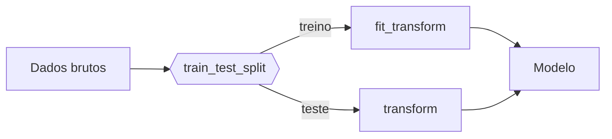

# 1. Data

!!! abstract "Enunciado"

    [Exercises → Data](https://insper.github.io/ann-dl/){:target='_blank'}

!!! tip "Este arquivo é o modelo de relatório"

    A estrutura de títulos abaixo **espelha o enunciado**: `## Exercise N` para cada
    exercício, `### A`, `### B`, ... para cada item. Mantenha essa ordem — a correção
    percorre o relatório procurando por ela. Apague os blocos de instrução (como este)
    conforme for preenchendo.

## Exercise 1

### Abordagem

Descreva em 3–5 linhas *o que* foi feito e *por quê*: como os dados foram gerados, quais
parâmetros do enunciado foram usados e qual semente aleatória garante a reprodutibilidade.

### Código

O script vive em [`code/exercise1_point_clouds.py`](https://github.com/usuario/ann-dl/blob/main/docs/exercises/data/code/exercise1_point_clouds.py)
e é incluído aqui pelo próprio arquivo — nunca copie e cole o texto do código, use a
inclusão para que relatório e repositório nunca fiquem fora de sincronia.

``` { .python .copy .select linenums='1' title="docs/exercises/data/code/exercise1_point_clouds.py" }
--8<-- "docs/exercises/data/code/exercise1_point_clouds.py"
```

1.  Semente fixa: sem ela, os números da tabela de resultados mudam a cada execução e a
    correção não consegue reproduzir o seu relatório.
2.  `plt.close(fig)` evita o vazamento de figuras quando o script gera várias em sequência.

### Figuras


/// caption
**Figura 1** — Dispersão das quatro classes no plano $(x_1, x_2)$ com `scale = 1.0`.
///

### Análise

Responda às perguntas do enunciado **citando os números** que você mediu. Uma resposta do
tipo "as classes ficam mais misturadas" vale pouco; "o *separation ratio* cai de 4.13 para
1.02 quando `scale` vai de 0.5 para 2.0, e a taxa de mistura sobe de 0.4% para 18.7%" vale.

## Exercise 2

### Abordagem

### Código

### Figuras

### Análise

!!! note "Fronteiras não lineares"

    Para justificar por que as cascas concêntricas exigem fronteira não linear, ajuda
    escrever a condição de decisão. Um separador linear é

    $$
    f(\mathbf{x}) = \mathbf{w}^\top \mathbf{x} + b,
    $$

    enquanto a estrutura das cascas depende de $\lVert \mathbf{x} - \boldsymbol{\mu} \rVert$,
    que não é expressável nessa forma.

## Exercise 3

### Abordagem

### Código

### Figuras

### Análise

!!! warning "Vazamento de dados"

    O `train_test_split` vem **antes** de qualquer imputação, encoding ou escalonamento.
    Ajuste os transformadores só no treino e aplique-os ao teste.



## Results summary

Preencha **todas** as linhas — linha em branco é lida como exercício incompleto.

| # | Métrica | Valor |
|---|---------|-------|
| 1 | Separation ratio (`scale = 0.5`) | |
| 2 | Separation ratio (`scale = 1.0`) | |
| 3 | Separation ratio (`scale = 2.0`) | |
| 4 | Taxa de mistura (`scale = 1.0`) | |
| 5 | Distância entre centros — gaussianas 5D | |
| 6 | Variância explicada — PC1 + PC2 | |
| 7 | Raio médio — casca interna | |
| 8 | Raio médio — casca externa | |
| 9 | Amostras de treino após o split | |
| 10 | Amostras de teste após o split | |
| 11 | Colunas com valores ausentes | |
| 12 | Features após o encoding | |
| 13 | Faixa das features após o escalonamento | |

## Discussão

O que foi difícil? Onde a intuição falhou? Que decisão você tomaria diferente?

## Conclusão

O que este exercício mostrou sobre a relação entre distribuição dos dados e a complexidade
da fronteira de decisão que a rede precisa aprender?
